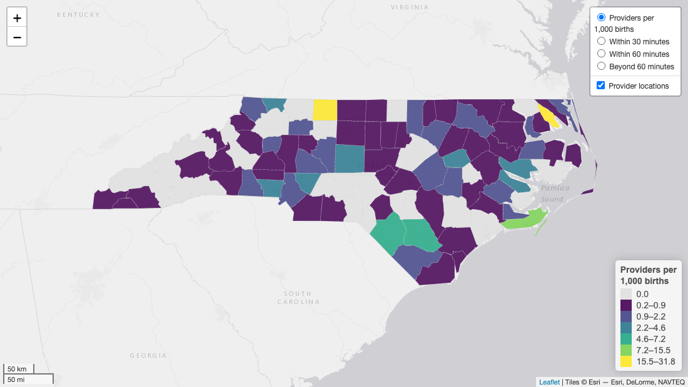
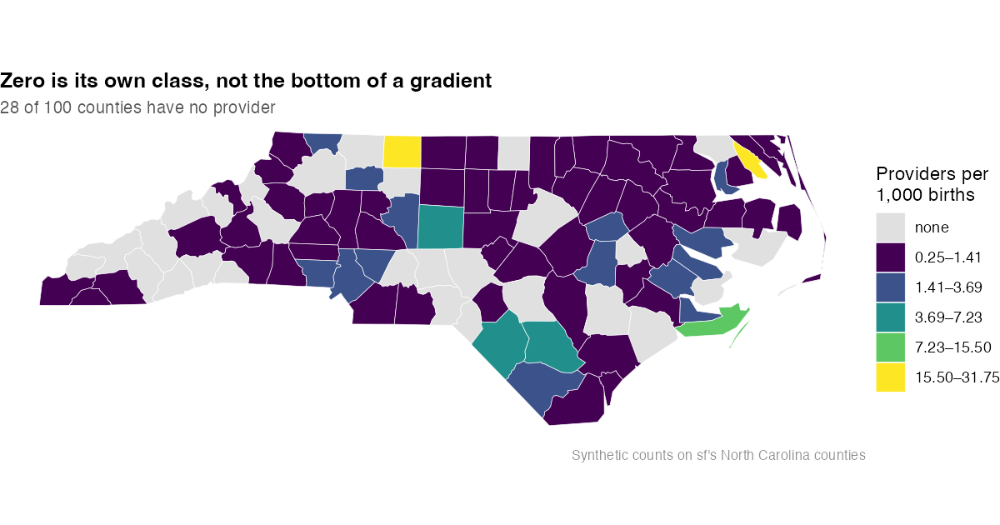

# mysterymaps

<!-- badges: start -->
[](https://github.com/mufflyt/mysterymaps/actions/workflows/R-CMD-check.yaml)
[](https://opensource.org/licenses/MIT)
[](https://lifecycle.r-lib.org/articles/stages.html#experimental)
[](https://cran.r-project.org/)
<!-- badges: end -->

Geographic mapping tools for healthcare access and mystery-caller studies:
county choropleths, drive-time coverage surfaces, provider dot maps, and the
label and legend furniture those need.

The package exists because the same map kept getting rebuilt. A supply
choropleth with drive-time surfaces over it, a legend that follows the active
layer, provider dots that stay clickable — three separate studies hand-built
that, differently each time, and the differences were bugs rather than choices.

## Install

```r
# install.packages("remotes")
remotes::install_github("mufflyt/mysterymaps")
```

Mapping dependencies (`leaflet`, `leaflet.extras`, `sf`, `ggplot2`,
`htmlwidgets`) are Suggests: install what your map actually uses.

---

## A leaflet access map

One call assembles the choropleth, the coverage surfaces as mutually exclusive
layers, the legend switcher and the framing.



```r
library(mysterymaps)
library(sf)

nc <- st_read(system.file("shape/nc.shp", package = "sf"), quiet = TRUE) |>
  st_transform(4326)

# sf's nc has no provider counts; these are synthetic, seeded, and exist only
# to exercise the scales (see data-raw/make_readme_figures.R).
set.seed(42)
nc$providers <- rpois(nrow(nc), 1.2)
nc$births    <- round(runif(nrow(nc), 120, 4200))
nc$rate      <- round(1000 * nc$providers / nc$births, 2)

nc$.tooltip <- sprintf("<b>%s</b><br/>%s", nc$NAME,
                       mysterymaps_pluralize(nc$providers, "provider"))

m <- mysterymaps_county_access_map(
  counties        = nc,
  value_col       = "rate",
  label_col       = ".tooltip",
  popup_col       = ".popup",
  coverage        = list("Within 30 minutes" = band_30,
                         "Within 60 minutes" = band_60,
                         "Beyond 60 minutes" = gap),
  coverage_colors = c("#08519c", "#3182bd", "#d94801"),
  legend_title    = "Providers per<br/>1,000 births",
  bounds          = c(33.7, -84.4, 36.7, -75.4))
```

Add provider dots and a search box afterwards, when they need their own popups:

```r
m <- m |>
  leaflet::addCircleMarkers(
    data = providers, radius = 4, label = ~name, popup = ~popup_html,
    options = leaflet::pathOptions(pane = "pts"),   # pane keeps them clickable
    group = "Providers") |>
  mysterymaps_zoom_gated_labels("Providers", min_zoom = 9, max_labels = 400) |>
  mysterymaps_name_search(placeholder = "Search provider name…")
```

Building a map that is *not* the county template? The pieces are exported
individually:

```r
m <- leaflet::leaflet() |>
  leaflet::addProviderTiles("CartoDB.PositronNoLabels") |>
  leaflet::addPolygons(data = counties, fillColor = ~pal(rate), group = "Supply") |>
  mysterymaps_register_base_legend("Supply", key = "supply") |>
  mysterymaps_add_coverage_surfaces(
    surfaces = list("Within 30 minutes" = band_30),
    colors   = "#08519c") |>
  leaflet::addLayersControl(baseGroups = c("Supply", "Within 30 minutes"))

m <- mysterymaps_base_legend_switcher(m, default = "Supply")
```

---

## A static map

`mysterymaps_jenks_zero_scale()` is renderer-agnostic — it returns a colour
function plus legend vectors, so it drops into `ggplot2` as readily as leaflet.



```r
library(ggplot2)

sc <- mysterymaps_jenks_zero_scale(nc$rate, k = 5, digits = 2)
sc$leg_labs[1] <- "none"          # "0.00" is accurate; "none" is clearer

ggplot(nc) +
  geom_sf(aes(fill = sc$color(rate)), colour = "white", linewidth = 0.15) +
  scale_fill_identity(guide = "legend", breaks = sc$leg_cols,
                      labels = sc$leg_labs, name = "Providers per\n1,000 births") +
  theme_void()
```

Other static (ggplot2) maps:

| Function | Produces |
|---|---|
| `mysterymaps_geographic_map()` | state choropleth of an outcome rate |
| `mysterymaps_map_acceptance_rate()` | state or HRR acceptance-rate choropleth |
| `mysterymaps_hrr_maps()` | Hospital Referral Region maps, by trait |

---

## Why the defaults are what they are

Each of these is a bug someone shipped first.

**Zero is a category, not a low value.** An equal-interval bottom bin of
`0.0–0.5` renders a county with *no* provider identically to one with a low
rate. On one national map that was 1,619 of 3,109 counties — over half the map,
in the class the study was about. `mysterymaps_jenks_zero_scale()` gives zero
its own colour and Jenks-classifies only the positive values, which also suits
provider rates being heavily right-skewed.

**Coverage surfaces are base groups, not overlays.** A translucent surface laid
over a viridis choropleth multiplies two colour scales into a third belonging to
neither. They are alternative views of a map, not additions to it.

**`leaflet::addLegend(group=)` does nothing for base groups.** It follows
*overlay* groups only, so a map with four base layers renders all four legends
at once, stacked down the edge. `mysterymaps_base_legend_switcher()` is the fix,
and it is why legends are registered rather than just added.

**Markers need a pane.** Without `addMapPane("pts", zIndex = 650)` and
`pathOptions(pane = "pts")`, dots draw above a choropleth but do not reliably
hit-test — clicks land on the polygon underneath. The template sets the pane up
for you.

**No marker clustering.** Clustering replaces the data with a count and makes
the reader zoom repeatedly to learn anything. Draw every point on a canvas
renderer (`preferCanvas = TRUE`) and gate the *labels* with
`mysterymaps_zoom_gated_labels()` instead.

**Widgets stay self-contained.** `mysterymaps_name_search()` uses the plugin
bundled with `leaflet.extras` rather than a CDN. A saved map that needs the
network for its search box fails silently offline, and a control that silently
does nothing is worse than an absent one.

---

## Labels

Counts and nouns that agree, and administrative text fit to read:

```r
mysterymaps_pluralize(c(0, 1, 3, NA), "midwife", "midwives")
#> "0 midwives" "1 midwife" "3 midwives" NA

mysterymaps_format_credentials(c("C.N.M.", "RN, CNM", "cnm/whnp"))
#> "CNM" "RN, CNM" "CNM, WHNP"

mysterymaps_place_title_case("EGG HARBOR TOWNSHIP, NJ")
#> "Egg Harbor Township, NJ"
```

`NA` propagates as `NA` rather than becoming a count, because "NA midwives" and
"0 midwives" are different claims; substitute your own placeholder at the point
of display. `mysterymaps_format_credentials()` formats and deliberately
does **not** classify — folding `ARNP` into `APRN` is a substantive claim about
credentialing that belongs in a reviewed classifier, not a label helper.

`mysterymaps_notes_panel()` renders the collapsible caveat panel with a data
vintage list, once, instead of repeating caveats in every popup.

---

## Isochrones and overlap

| Function | Purpose |
|---|---|
| `mysterymaps_create_isochrones()` | drive-time polygons for one location |
| `mysterymaps_isochrones_for_df()` | the same over a data frame of locations |
| `mysterymaps_calculate_overlap()` | block-group × isochrone area overlap |
| `mysterymaps_gate_provider_coverage()` | fail loudly when providers fall outside a surface |
| `mysterymaps_clear_isochrone_cache()` | drop the cached routing results |
| `mysterymaps_geocode()` | geocode an address file |

---

## Reproducing the figures

```sh
Rscript data-raw/make_readme_figures.R
```

Both use the North Carolina counties shipped inside `sf`, with synthetic seeded
counts — no API key, no network, no private data. The counts exercise the
scales; they say nothing about North Carolina.

## Citation

```r
citation("mysterymaps")
```

`CITATION.cff` and `CITATION.bib` carry the same entry for GitHub and reference
managers. ORCID [0000-0002-2044-1693](https://orcid.org/0000-0002-2044-1693).

## Contributing

See [CONTRIBUTING.md](CONTRIBUTING.md). The first rule is to search the
cross-repo function index before writing a helper: this ecosystem has been bitten
repeatedly by the same function existing twice, with load order deciding which
one ran.

## Related

- [`mufflyaccess`](https://github.com/mufflyt/mufflyaccess) — SSOT constants and
  safe arithmetic: canonical bands, CONUS geography, `safe_rate()`
- `twostep` — E2SFCA accessibility, population-weighted coverage, the
  access-language guard
- `isochrones` — routing, water masks, the isochrone pipeline
- `cliff` — workforce retirement modelling

`vignette("canonical-functions")` maps hand-rolled code to the canonical call
that already exists across these packages.
